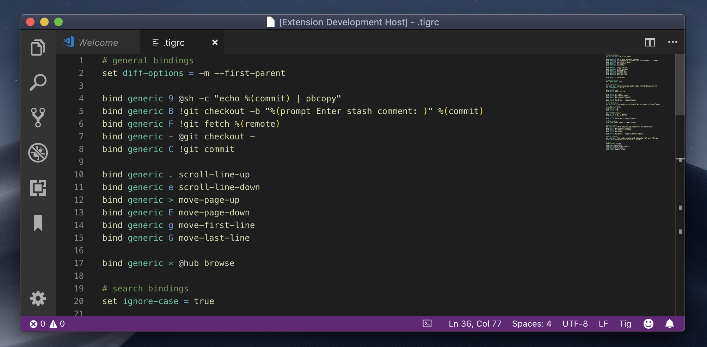
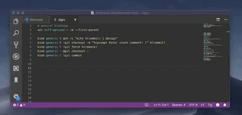

# VSCode Tig Language Support

VSCode Language Extention for Tig configuration file `~.tigrc`.

## Features
### 1. Syntaxs Highlighting

Syntax highlighting for Tig file `.tigrc` including comments.

### 2. Tig Snippets

We offer snippets for all functions prepared for tig.

- `set`
- `bind`
- `color`
- `source`

## Contributor

- [KeisukeYamashita](https://github.com/KeisukeYamashita)
